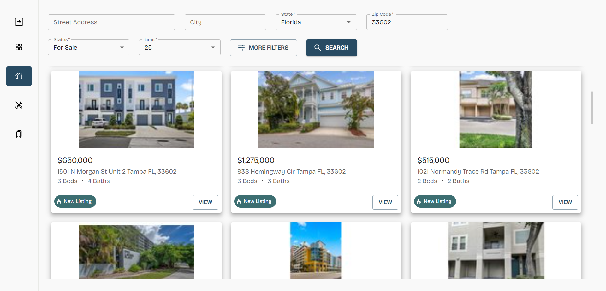

# HomeFinder - Real Estate Project 

# Built with:
  - Vite.js
  - Material UI

# Features
  - Uses RapidAPI (Realtor.com) to find homes in your area
  - Financial tools to determine your rates/affordability
  - Fully responsive design for mobile and web browsers
  - Save & retrieve favorite listings using session data
  - Uses Axios to interact with RapidAPI

For a more detailed list of its features, visit my portfolio and click on [HomeFinder](https://mmcdev.pro/portfolio) project

# [Live Preview](https://homefinder-pied.vercel.app)

